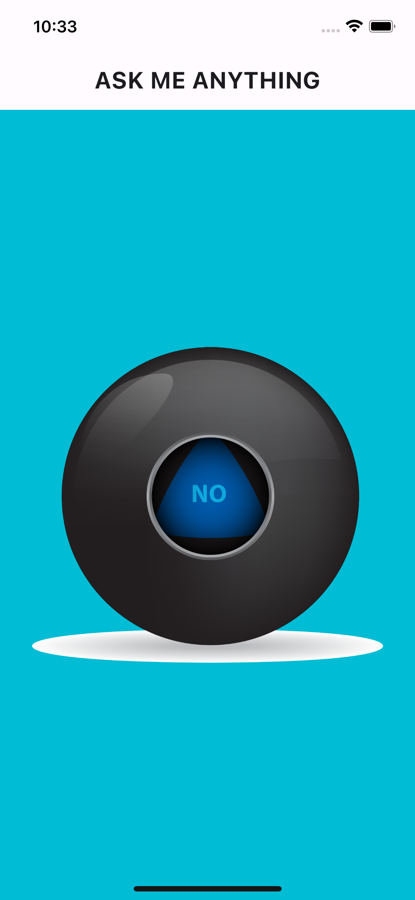

# Magic 8 Ball

Magic 8 Ball is a simple Flutter application for decision making. It simulates the experience of shaking a magic 8 ball to receive answers to your questions. The app provides random responses such as "Yes", "No", "The answer is yes", "I have no idea", and "Ask me later".

## Features

- Tap on the magic 8 ball to receive a random response.
- The ball displays various answers, adding an element of surprise to the decision-making process.

## Usage

1. Install Flutter on your development environment.
2. Clone this repository.
3. Navigate to the project directory.
4. Run `flutter pub get` to install dependencies.
5. Run `flutter run` to launch the application on your connected device or simulator.

## Screenshots

## Acknowledgements

- This application is inspired by the traditional Magic 8 Ball toy, known for providing entertaining and sometimes cryptic answers to questions.

## Contributing

Contributions are welcome! If you have any ideas for improvements or feature requests, feel free to submit a pull request.

